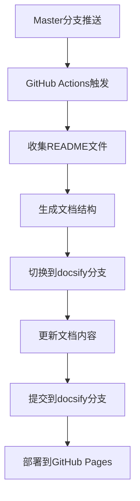

# EmbedKit 分支架构修正指南

## 📋 问题概述

本文档描述了EmbedKit项目分支架构的修正过程，解决了以下问题：

### 🚨 修正前的问题
1. **master分支被文档系统污染** - docsify相关文件混入代码分支
2. **分支职责混乱** - 文档系统和代码混在同一个分支
3. **工作流配置冲突** - 存在重复和冲突的GitHub Actions配置
4. **缺少实际C代码结构** - 没有标准的C项目目录组织

### ✅ 修正后的架构
1. **master分支** - 纯净的C代码项目，包含源码、示例和工作流
2. **docsify分支** - 独立的文档站点，自动从master收集内容
3. **自动化工作流** - master推送触发文档收集→docsify分支更新→GitHub Pages部署

---

## 🏗️ 正确的分支架构

### Master分支结构
```
EmbedKit/ (master分支)
├── .github/
│   ├── workflows/
│   │   └── docs-deploy.yml      # 文档部署工作流
│   ├── ISSUE_TEMPLATE/          # Issue模板
│   ├── pull_request_template.md # PR模板
│   └── CODEOWNERS              # 代码所有者
├── src/                        # 源代码目录
│   ├── memory/                 # 内存管理模块
│   ├── data_structures/        # 数据结构模块
│   ├── scheduler/              # 调度器模块
│   └── README.md              # 源码总览
├── include/                    # 头文件目录
├── examples/                   # 示例代码
│   ├── basic/                  # 基础示例
│   └── advanced/               # 高级示例
├── tests/                      # 测试代码
├── scripts/                    # 工具脚本
│   └── init-docsify-branch.sh  # docsify分支初始化脚本
├── README.md                   # 项目主README
├── LICENSE                     # 许可证
└── .gitignore                  # Git忽略文件
```

### Docsify分支结构
```
EmbedKit/ (docsify分支)
└── docs/                       # docsify站点
    ├── index.html              # docsify配置
    ├── README.md               # 文档首页
    ├── _sidebar.md             # 侧边栏导航
    ├── _navbar.md              # 顶部导航
    ├── _coverpage.md           # 封面页
    ├── _404.md                 # 404页面
    ├── .nojekyll               # GitHub Pages配置
    ├── modules/                # 自动收集的模块文档
    ├── examples/               # 自动收集的示例文档
    ├── api/                    # API文档
    └── assets/                 # 静态资源
```

---

## ⚙️ 自动化工作流程

### 工作流触发机制


### 文档收集规则
- **主README**: `README.md` → `docs/README.md`
- **模块文档**: `src/*/README.md` → `docs/modules/*.md`
- **示例文档**: `examples/*/README.md` → `docs/examples/*.md`
- **自动生成**: 侧边栏导航、索引页面

---

## 🛠️ 已执行的修正操作

### 1. 清理Master分支
```bash
# 删除docsify相关文件
git rm -r docs/
git rm -r .docsify/
git rm CONTRIBUTING.md BRANCH_PROTECTION_GUIDE.md package.json
git rm -r scripts/ (旧文档脚本)
git rm .github/DEPLOYMENT_SETUP.md .github/README.md .github/TROUBLESHOOTING.md
git rm -r .github/scripts/
git rm .github/workflows/deploy-docs.yml .github/workflows/docs.yml
```

### 2. 创建标准C项目结构
```bash
mkdir -p src/{memory,data_structures,scheduler}
mkdir -p include examples/{basic,advanced} tests
```

### 3. 创建示例模块文档
- `src/memory/README.md` - 内存管理模块文档
- `src/data_structures/README.md` - 数据结构模块文档
- `src/scheduler/README.md` - 任务调度模块文档

### 4. 创建示例代码说明
- `examples/basic/README.md` - 基础使用示例
- `examples/advanced/README.md` - 高级应用场景

### 5. 重写GitHub Actions工作流
创建 `.github/workflows/docs-deploy.yml`，实现：
- master分支推送触发
- 自动收集README文件
- 生成docsify站点结构
- 部署到GitHub Pages

### 6. 创建docsify分支
```bash
git checkout -b docsify
git push -u origin docsify
```

### 7. 更新主README
- 修改文档链接指向在线文档站点
- 优化项目介绍和使用说明

---

## 📝 手动操作步骤

如果需要手动执行修正操作，按以下步骤进行：

### 步骤1: 初始化docsify分支
```bash
# 切换到master分支
git checkout master

# 运行初始化脚本
bash scripts/init-docsify-branch.sh

# 提交docsify分支
git commit -m "初始化docsify文档站点"
git push -u origin docsify
```

### 步骤2: 配置GitHub Pages
1. 进入GitHub仓库设置页面
2. 滚动到"Pages"部分
3. 选择"Source": `Deploy from a branch`
4. 选择"Branch": `docsify`
5. 选择"Folder": `/ (root)` 或 `/docs`
6. 点击"Save"

### 步骤3: 验证工作流
1. 在master分支修改任何README文件
2. 推送到master分支
3. 查看Actions页面确认工作流执行
4. 检查docsify分支是否自动更新
5. 访问GitHub Pages URL确认文档站点

---

## 🔍 验证修正结果

### 检查Master分支
```bash
git checkout master
ls -la
# 应该看到：src/, include/, examples/, tests/, .github/workflows/docs-deploy.yml
# 不应该看到：docs/, .docsify/, package.json
```

### 检查Docsify分支
```bash
git checkout docsify
ls -la docs/
# 应该看到：index.html, README.md, _sidebar.md, 等docsify文件
```

### 检查工作流
- 访问仓库的Actions页面
- 确认"部署文档系统"工作流存在且可执行
- 推送到master分支后应自动触发

### 检查文档站点
- 访问 `https://<username>.github.io/<repository>/`
- 确认文档站点正常显示
- 验证导航和搜索功能

---

## 📊 修正效果对比

| 方面 | 修正前 | 修正后 |
|------|--------|--------|
| **Master分支** | 被文档文件污染 | 纯净的C代码项目 |
| **文档系统** | 与代码混合 | 独立的docsify分支 |
| **工作流** | 冲突的配置文件 | 单一清晰的工作流 |
| **维护性** | 手动维护文档 | 自动收集和部署 |
| **分支职责** | 混乱不清 | 职责分离明确 |
| **项目结构** | 缺少标准结构 | 标准C项目结构 |

---

## 🎯 后续维护

### 添加新模块文档
1. 在 `src/new_module/` 下创建 `README.md`
2. 推送到master分支
3. 工作流自动收集到docsify分支

### 添加新示例
1. 在 `examples/category/` 下创建 `README.md`  
2. 推送到master分支
3. 文档站点自动更新

### 更新文档站点配置
1. 切换到docsify分支: `git checkout docsify`
2. 修改 `docs/index.html` 或其他配置文件
3. 推送更改: `git push origin docsify`

---

## ❓ 常见问题

### Q: 为什么要分离分支？
**A**: 分离分支可以：
- 保持代码分支的纯净性
- 独立维护文档系统
- 支持自动化文档收集
- 避免工作流配置冲突

### Q: 如何添加新的文档？
**A**: 在对应的目录下创建README.md文件，推送到master分支即可自动收集。

### Q: docsify分支可以手动修改吗？
**A**: 可以，但要注意：
- 自动收集的文件会被覆盖
- 建议只修改配置文件和静态页面
- 内容文档应该在master分支维护

### Q: 工作流失败怎么办？
**A**: 
1. 检查Actions日志查看错误原因
2. 确认docsify分支存在
3. 检查GitHub Pages设置
4. 验证权限配置

---

## 🔗 相关链接

- [GitHub Actions文档](https://docs.github.com/en/actions)
- [GitHub Pages配置](https://docs.github.com/en/pages)  
- [Docsify官方文档](https://docsify.js.org/)
- [项目仓库](https://github.com/zuoliangyu/EmbedKit)
- [在线文档](https://zuoliangyu.github.io/EmbedKit/)

---

**📅 文档创建**: 2025-09-08  
**🔄 最后更新**: 2025-09-08  
**👤 创建者**: Claude Code  