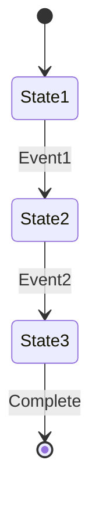

# 模块名称 README 模板

> 这是一个标准的模块 README 模板，用于规范 EmbedKit 各模块的文档格式。
> 使用时请替换所有占位符内容。

---

# [模块名称]

## 概述

[简要描述模块的功能和用途，2-3句话]

## 特性

- ✅ **特性1** - [简要说明]
- ✅ **特性2** - [简要说明]
- ✅ **特性3** - [简要说明]
- ✅ **特性4** - [简要说明]

## 快速示例

```c
#include "embedkit/[module_name]/[header].h"

// 快速示例代码
// 展示最基本的用法
int main(void) {
    // 初始化
    ek_[module]_init();
    
    // 基本操作
    ek_[module]_operation();
    
    return 0;
}
```

## 详细文档

### 基本概念

[解释模块的核心概念和原理]

#### 概念1
[详细说明]

#### 概念2
[详细说明]

### API 参考

#### 初始化函数

```c
/**
 * @brief 初始化模块
 * @param config 配置参数
 * @return 成功返回 EK_OK
 */
int ek_[module]_init(const ek_[module]_config_t* config);
```

#### 核心函数

```c
/**
 * @brief 核心操作函数
 * @param param 参数说明
 * @return 返回值说明
 */
int ek_[module]_operation(void* param);
```

### 配置选项

| 宏定义 | 默认值 | 说明 |
|--------|--------|------|
| `EK_[MODULE]_ENABLE` | 1 | 启用模块 |
| `EK_[MODULE]_MAX_SIZE` | 32 | 最大容量 |
| `EK_[MODULE]_USE_DMA` | 0 | 使用 DMA |

### 使用示例

#### 示例1：[场景名称]

```c
// 完整的使用示例
#include "embedkit/[module].h"

// 示例代码
void example_1(void) {
    // 详细的示例实现
}
```

#### 示例2：[场景名称]

```c
// 另一个使用场景
void example_2(void) {
    // 详细的示例实现
}
```

## 设计说明

### 架构设计

```
[模块名称]
    ├── 核心层
    │   ├── 组件1
    │   └── 组件2
    ├── 接口层
    │   └── API 接口
    └── 硬件抽象层
        └── 平台适配
```

### 内存布局

```c
typedef struct {
    // 结构体布局说明
    uint32_t field1;  // 字段1说明
    uint32_t field2;  // 字段2说明
} ek_[module]_t;
```

### 状态机



## 性能指标

### 时间复杂度

| 操作 | 复杂度 | 典型时间 |
|------|--------|----------|
| 初始化 | O(1) | < 1ms |
| 插入 | O(1) | < 10μs |
| 查找 | O(n) | < 100μs |
| 删除 | O(1) | < 10μs |

### 空间复杂度

| 组件 | ROM占用 | RAM占用 |
|------|---------|---------|
| 核心代码 | ~2KB | ~512B |
| 每个实例 | 0 | 64B |

### 基准测试

测试环境：ARM Cortex-M4 @ 72MHz

```
操作类型        次数      总时间    平均时间
初始化         1000      45ms      45μs
数据处理       10000     120ms     12μs
清理           1000      30ms      30μs
```

## 移植指南

### 硬件要求

- 最小 RAM：[数值]
- 最小 ROM：[数值]
- 处理器：[要求]

### 移植步骤

1. **实现硬件抽象层**
   ```c
   // 需要实现的接口
   void ek_[module]_port_init(void);
   uint32_t ek_[module]_port_read(void);
   ```

2. **配置编译选项**
   ```makefile
   CFLAGS += -DEK_[MODULE]_CUSTOM_CONFIG
   ```

3. **适配平台特性**
   ```c
   #ifdef PLATFORM_SPECIFIC
   // 平台特定代码
   #endif
   ```

## 最佳实践

### DO's (推荐做法)

- ✅ 在初始化时预分配所有资源
- ✅ 使用静态内存分配
- ✅ 检查所有返回值
- ✅ 合理设置缓冲区大小

### DON'Ts (避免做法)

- ❌ 在中断中执行长时间操作
- ❌ 使用动态内存分配
- ❌ 忽略错误返回值
- ❌ 递归调用

### 代码示例

```c
// 好的做法
if (ek_[module]_init(&config) != EK_OK) {
    // 错误处理
    return ERROR;
}

// 避免的做法
ek_[module]_init(&config);  // 忽略返回值
```

## 故障排除

### 常见问题

#### Q1: [问题描述]
**A:** [解决方案]

#### Q2: [问题描述]
**A:** [解决方案]

### 错误码

| 错误码 | 含义 | 解决方法 |
|--------|------|----------|
| `EK_ERROR_1` | [说明] | [方法] |
| `EK_ERROR_2` | [说明] | [方法] |

### 调试技巧

1. **启用调试输出**
   ```c
   #define EK_[MODULE]_DEBUG 1
   ```

2. **使用断言检查**
   ```c
   EK_ASSERT(condition);
   ```

3. **查看运行时统计**
   ```c
   ek_[module]_stats_t stats;
   ek_[module]_get_stats(&stats);
   ```

## 版本历史

### v1.0.0 (2024-01-01)
- 初始版本
- 基本功能实现

### v0.9.0 (2023-12-01)
- Beta 版本
- 功能测试

## 相关资源

### 内部链接
- [API 详细文档](../../api/[module].md)
- [示例代码](../../examples/[module]/)
- [测试用例](../../tests/[module]/)

### 外部链接
- [相关标准文档]()
- [参考实现]()
- [学术论文]()

## 贡献指南

欢迎贡献代码和文档！请参考 [贡献指南](../../CONTRIBUTING.md)。

### 开发者
- 主要开发者：[姓名]
- 贡献者：[列表]

### 许可证
MIT License - 详见 [LICENSE](../../LICENSE)

---

*最后更新：[日期]*