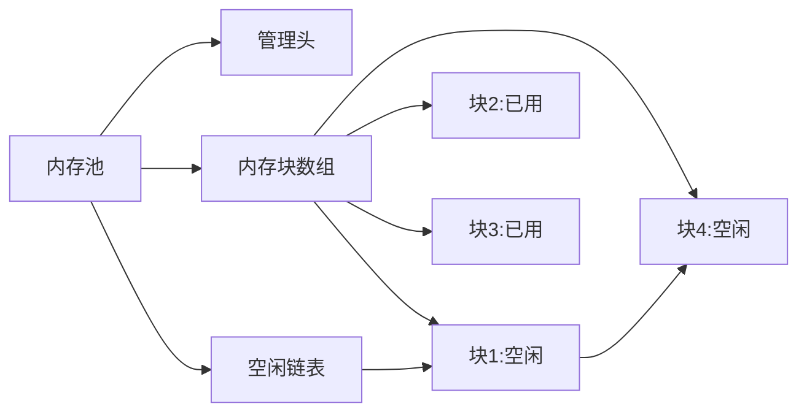

# 内存管理模块

## 概述

EmbedKit的内存管理模块提供了高效、安全的内存分配机制，专门针对嵌入式系统的特点进行了优化。支持静态内存池、动态堆管理和内存调试功能。

## 特性

- ✅ **固定大小内存池** - O(1)时间复杂度分配/释放
- ✅ **可变大小堆管理** - 支持动态内存分配
- ✅ **内存对齐** - 自动处理平台对齐要求
- ✅ **碎片防护** - 最小化内存碎片
- ✅ **溢出检测** - 运行时边界检查
- ✅ **统计跟踪** - 内存使用统计

## 内存池 (Memory Pool)

### 基本概念

内存池将一块连续内存划分为固定大小的块，提供快速的分配和释放操作。

```c
#include "embedkit/memory/pool.h"

// 定义内存池缓冲区
#define POOL_SIZE       4096
#define BLOCK_SIZE      64
static uint8_t pool_buffer[POOL_SIZE];

// 初始化内存池
ek_pool_t* pool = ek_pool_init(
    pool_buffer,    // 缓冲区
    POOL_SIZE,      // 总大小
    BLOCK_SIZE      // 块大小
);

// 分配内存块
void* block = ek_pool_alloc(pool);
if (block != NULL) {
    // 使用内存块
    memset(block, 0, BLOCK_SIZE);
    
    // 释放内存块
    ek_pool_free(pool, block);
}
```

### 内存池设计



### 高级用法

#### 多尺寸内存池

```c
// 创建不同尺寸的内存池
typedef struct {
    ek_pool_t* small_pool;   // 32字节块
    ek_pool_t* medium_pool;  // 128字节块
    ek_pool_t* large_pool;   // 512字节块
} memory_pools_t;

static uint8_t small_buffer[1024];
static uint8_t medium_buffer[2048];
static uint8_t large_buffer[4096];

memory_pools_t pools;

void memory_init(void) {
    pools.small_pool = ek_pool_init(small_buffer, 1024, 32);
    pools.medium_pool = ek_pool_init(medium_buffer, 2048, 128);
    pools.large_pool = ek_pool_init(large_buffer, 4096, 512);
}

// 智能分配函数
void* smart_alloc(size_t size) {
    if (size <= 32) {
        return ek_pool_alloc(pools.small_pool);
    } else if (size <= 128) {
        return ek_pool_alloc(pools.medium_pool);
    } else if (size <= 512) {
        return ek_pool_alloc(pools.large_pool);
    }
    return NULL;  // 尺寸过大
}
```

#### 带标记的内存池

```c
// 内存块标记
typedef struct {
    uint32_t magic;     // 魔数标记
    uint32_t owner_id;  // 所有者ID
    uint32_t alloc_time; // 分配时间
    uint8_t data[];     // 实际数据
} tagged_block_t;

// 分配带标记的内存
tagged_block_t* tagged_alloc(ek_pool_t* pool, uint32_t owner_id) {
    tagged_block_t* block = ek_pool_alloc(pool);
    if (block) {
        block->magic = 0xDEADBEEF;
        block->owner_id = owner_id;
        block->alloc_time = get_system_time();
    }
    return block;
}

// 验证内存块
bool tagged_verify(tagged_block_t* block) {
    return (block->magic == 0xDEADBEEF);
}
```

## 堆管理 (Heap Management)

### 动态内存分配

```c
#include "embedkit/memory/heap.h"

// 初始化堆
#define HEAP_SIZE 8192
static uint8_t heap_buffer[HEAP_SIZE];

ek_heap_t* heap = ek_heap_init(heap_buffer, HEAP_SIZE);

// 分配内存
void* ptr = ek_malloc(heap, 256);
if (ptr) {
    // 使用内存
    strcpy(ptr, "Hello, EmbedKit!");
    
    // 重新分配
    ptr = ek_realloc(heap, ptr, 512);
    
    // 释放内存
    ek_free(heap, ptr);
}

// 获取统计信息
ek_heap_stats_t stats;
ek_heap_get_stats(heap, &stats);
printf("Used: %d, Free: %d, Fragments: %d\n",
       stats.used_bytes, stats.free_bytes, stats.fragment_count);
```

### 内存分配策略

#### 首次适应 (First Fit)

```c
// 配置为首次适应策略
ek_heap_config_t config = {
    .strategy = EK_HEAP_FIRST_FIT,
    .alignment = 8,
    .min_block_size = 16
};

ek_heap_t* heap = ek_heap_init_ex(heap_buffer, HEAP_SIZE, &config);
```

#### 最佳适应 (Best Fit)

```c
// 配置为最佳适应策略
config.strategy = EK_HEAP_BEST_FIT;
```

### 内存碎片管理

```c
// 碎片整理
void defragment_heap(ek_heap_t* heap) {
    // 合并相邻的空闲块
    ek_heap_coalesce(heap);
    
    // 获取碎片统计
    size_t fragment_count = ek_heap_get_fragment_count(heap);
    size_t largest_free = ek_heap_get_largest_free_block(heap);
    
    printf("Fragments: %d, Largest free: %d\n", 
           fragment_count, largest_free);
}

// 碎片预防策略
typedef struct {
    size_t threshold;      // 碎片阈值
    size_t last_defrag;   // 上次整理时间
} defrag_policy_t;

void smart_free(ek_heap_t* heap, void* ptr, defrag_policy_t* policy) {
    ek_free(heap, ptr);
    
    // 检查是否需要碎片整理
    if (ek_heap_get_fragment_count(heap) > policy->threshold) {
        if (get_time() - policy->last_defrag > 1000) {  // 1秒间隔
            ek_heap_coalesce(heap);
            policy->last_defrag = get_time();
        }
    }
}
```

## 内存对齐

### 自动对齐

```c
// 分配对齐的内存
void* aligned_ptr = ek_memalign(heap, 32, 256);  // 32字节对齐，256字节大小

// 检查对齐
assert((uintptr_t)aligned_ptr % 32 == 0);
```

### 平台特定对齐

```c
// ARM Cortex-M对齐要求
#ifdef __ARM_ARCH
    #define DMA_ALIGNMENT 4     // DMA需要4字节对齐
    #define CACHE_LINE    32    // 缓存行大小
#endif

// 为DMA分配内存
typedef struct {
    uint8_t data[512];
} __attribute__((aligned(DMA_ALIGNMENT))) dma_buffer_t;

dma_buffer_t* dma_buf = ek_memalign(heap, DMA_ALIGNMENT, sizeof(dma_buffer_t));
```

## 内存调试

### 内存泄漏检测

```c
// 启用调试模式
#define EK_MEMORY_DEBUG 1

// 带调试信息的分配
void* ptr = ek_malloc_debug(heap, 128, __FILE__, __LINE__);

// 检查内存泄漏
void check_memory_leaks(void) {
    ek_memory_leak_t leaks[10];
    int count = ek_memory_check_leaks(heap, leaks, 10);
    
    for (int i = 0; i < count; i++) {
        printf("Leak: %d bytes at %s:%d\n",
               leaks[i].size,
               leaks[i].file,
               leaks[i].line);
    }
}

// 注册清理函数
atexit(check_memory_leaks);
```

### 边界检查

```c
// 启用边界保护
typedef struct {
    uint32_t guard_start;   // 前哨兵
    uint8_t data[];        // 用户数据
    // uint32_t guard_end; // 后哨兵（在数据后）
} guarded_block_t;

// 分配带保护的内存
void* guarded_alloc(size_t size) {
    size_t total = sizeof(uint32_t) * 2 + size;
    guarded_block_t* block = ek_malloc(heap, total);
    
    if (block) {
        block->guard_start = 0xDEADBEEF;
        uint32_t* guard_end = (uint32_t*)((uint8_t*)block->data + size);
        *guard_end = 0xBEEFDEAD;
        return block->data;
    }
    return NULL;
}

// 验证内存完整性
bool verify_guards(void* ptr, size_t size) {
    guarded_block_t* block = container_of(ptr, guarded_block_t, data);
    uint32_t* guard_end = (uint32_t*)((uint8_t*)ptr + size);
    
    return (block->guard_start == 0xDEADBEEF) && 
           (*guard_end == 0xBEEFDEAD);
}
```

### 内存访问跟踪

```c
// 内存访问记录
typedef struct {
    void* address;
    size_t size;
    enum { READ, WRITE } type;
    uint32_t timestamp;
    const char* function;
} memory_access_t;

static memory_access_t access_log[100];
static int access_index = 0;

// 记录内存访问
void log_memory_access(void* addr, size_t size, int type, const char* func) {
    access_log[access_index].address = addr;
    access_log[access_index].size = size;
    access_log[access_index].type = type;
    access_log[access_index].timestamp = get_time();
    access_log[access_index].function = func;
    
    access_index = (access_index + 1) % 100;
}

// 包装的内存访问函数
void* traced_memcpy(void* dest, const void* src, size_t n) {
    log_memory_access((void*)src, n, READ, __func__);
    log_memory_access(dest, n, WRITE, __func__);
    return memcpy(dest, src, n);
}
```

## 性能优化

### 缓存友好设计

```c
// 缓存行对齐的数据结构
typedef struct {
    // 热数据（频繁访问）
    struct {
        uint32_t counter;
        uint32_t flags;
        void* current;
    } __attribute__((aligned(CACHE_LINE))) hot;
    
    // 冷数据（不常访问）
    struct {
        char name[32];
        uint32_t created;
        uint32_t modified;
    } __attribute__((aligned(CACHE_LINE))) cold;
} cache_optimized_t;
```

### 内存池预热

```c
// 预分配和预热内存池
void warmup_memory_pool(ek_pool_t* pool) {
    void* blocks[32];
    
    // 预分配所有块
    for (int i = 0; i < 32; i++) {
        blocks[i] = ek_pool_alloc(pool);
    }
    
    // 触摸每个内存页
    for (int i = 0; i < 32; i++) {
        if (blocks[i]) {
            memset(blocks[i], 0, ek_pool_get_block_size(pool));
        }
    }
    
    // 释放所有块
    for (int i = 0; i < 32; i++) {
        if (blocks[i]) {
            ek_pool_free(pool, blocks[i]);
        }
    }
}
```

## 配置选项

```c
// embedkit_config.h

// 内存池配置
#define EK_POOL_MAX_POOLS           8       // 最大内存池数
#define EK_POOL_USE_STATISTICS      1       // 启用统计
#define EK_POOL_USE_GUARD_BYTES     1       // 边界保护
#define EK_POOL_GUARD_PATTERN       0xAA    // 保护字节模式

// 堆配置
#define EK_HEAP_MIN_BLOCK_SIZE      16      // 最小块大小
#define EK_HEAP_ALIGNMENT           8       // 默认对齐
#define EK_HEAP_USE_BEST_FIT        1       // 使用最佳适应
#define EK_HEAP_ENABLE_STATS        1       // 启用统计
#define EK_HEAP_ENABLE_DEBUG        1       // 调试模式
```

## 内存使用指南

### 选择合适的分配器

| 场景 | 推荐方案 | 原因 |
|------|----------|------|
| 固定大小对象 | 内存池 | O(1)复杂度，无碎片 |
| 变长数据 | 堆管理 | 灵活但有碎片风险 |
| 临时缓冲 | 栈分配 | 自动管理，速度快 |
| DMA缓冲 | 对齐分配 | 满足硬件要求 |
| 长期对象 | 静态分配 | 无运行时开销 |

### 内存布局建议

```c
// 典型的嵌入式内存布局
typedef struct {
    // 系统区域
    uint8_t stack[2048];          // 系统栈
    uint8_t heap[4096];           // 动态堆
    
    // 内存池区域
    uint8_t small_pool[1024];     // 小对象池
    uint8_t medium_pool[2048];    // 中对象池
    uint8_t large_pool[4096];     // 大对象池
    
    // DMA区域（特殊对齐）
    uint8_t dma_buffer[512] __attribute__((aligned(32)));
    
    // 应用数据
    uint8_t app_data[8192];       // 应用特定数据
} system_memory_t;

static system_memory_t g_memory __attribute__((section(".ram")));
```

## 常见问题

### Q: 内存池 vs 堆，如何选择？

A: 
- **内存池**：适合固定大小、频繁分配/释放的场景
- **堆**：适合大小不定、生命周期较长的对象
- 建议：优先使用内存池，必要时才用堆

### Q: 如何避免内存碎片？

A:
1. 使用内存池代替频繁的malloc/free
2. 分配相似大小的内存块
3. 定期执行碎片整理
4. 采用双缓冲区策略

### Q: 内存对齐的影响？

A:
- **性能**：对齐的内存访问更快（特别是ARM）
- **正确性**：某些硬件（如DMA）要求特定对齐
- **空间**：对齐可能浪费内存
- 建议：根据平台要求设置合适的对齐值

## 相关链接

- [内存管理API](../api/memory.md)
- [内存安全最佳实践](../best_practices/memory_safety.md)
- [性能优化指南](../design/optimization.md#内存优化)
- [示例代码](../examples/memory_examples.md)