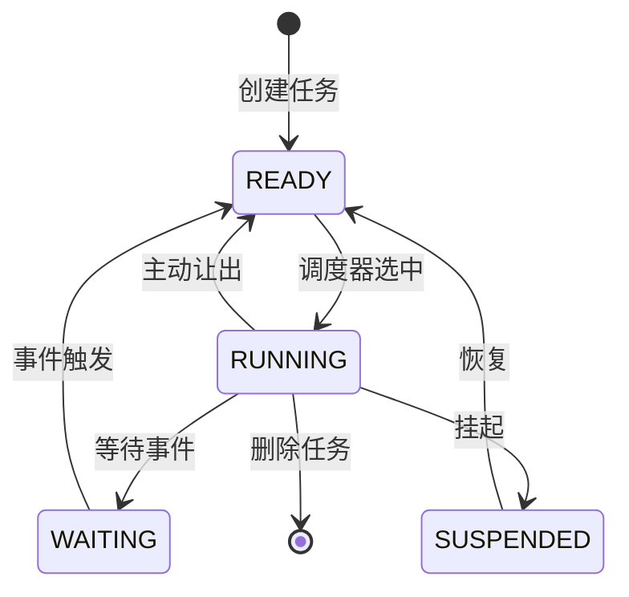

# 任务调度器模块

## 概述

EmbedKit的任务调度器是一个轻量级、高效的协作式任务调度系统，专为资源受限的嵌入式环境设计。它提供了任务管理、定时器服务和低功耗支持等核心功能。

## 特性

- ✅ **协作式调度** - 低开销，可预测的执行时间
- ✅ **优先级支持** - 多级优先级队列
- ✅ **周期任务** - 自动周期性执行
- ✅ **软定时器** - 毫秒级精度
- ✅ **低功耗模式** - 自动休眠支持
- ✅ **静态内存** - 无动态分配

## 快速示例

```c
#include "embedkit/scheduler/task.h"

// 定义任务函数
void led_blink_task(void* param) {
    static uint8_t state = 0;
    state = !state;
    gpio_write(LED_PIN, state);
}

void sensor_read_task(void* param) {
    uint16_t value = adc_read(SENSOR_CHANNEL);
    process_sensor_data(value);
}

int main(void) {
    // 初始化调度器
    ek_scheduler_init();
    
    // 创建任务
    ek_task_t* led_task = ek_task_create(
        led_blink_task,     // 任务函数
        NULL,               // 参数
        500,                // 周期: 500ms
        TASK_PRIORITY_LOW   // 优先级
    );
    
    ek_task_t* sensor_task = ek_task_create(
        sensor_read_task,
        NULL,
        100,                // 周期: 100ms
        TASK_PRIORITY_HIGH  // 高优先级
    );
    
    // 启动调度器
    ek_scheduler_start();
    
    // 永不返回
    return 0;
}
```

## 核心概念

### 任务状态机



### 任务优先级

系统支持8个优先级等级：

| 优先级 | 宏定义 | 用途建议 |
|--------|--------|----------|
| 0 | TASK_PRIORITY_IDLE | 空闲任务 |
| 1-2 | TASK_PRIORITY_LOW | 后台任务 |
| 3-4 | TASK_PRIORITY_NORMAL | 常规业务 |
| 5-6 | TASK_PRIORITY_HIGH | 重要任务 |
| 7 | TASK_PRIORITY_CRITICAL | 关键任务 |

## 任务管理

### 创建任务

```c
typedef struct {
    ek_task_func_t function;   // 任务函数
    void* param;                // 用户参数
    uint32_t period_ms;         // 执行周期(ms)
    uint8_t priority;           // 优先级
    const char* name;           // 任务名称(调试用)
} ek_task_config_t;

// 创建任务
ek_task_t* task = ek_task_create_ex(&(ek_task_config_t){
    .function = my_task_func,
    .param = &my_data,
    .period_ms = 1000,
    .priority = TASK_PRIORITY_NORMAL,
    .name = "MyTask"
});
```

### 任务控制

```c
// 挂起任务
ek_task_suspend(task);

// 恢复任务
ek_task_resume(task);

// 删除任务
ek_task_delete(task);

// 修改周期
ek_task_set_period(task, 2000);  // 改为2秒

// 获取任务信息
ek_task_info_t info;
ek_task_get_info(task, &info);
printf("Task %s: runs=%lu, cpu=%lu%%\n", 
       info.name, info.run_count, info.cpu_usage);
```

## 定时器服务

### 软定时器

```c
// 定时器回调
void timer_callback(void* param) {
    printf("Timer expired!\n");
}

// 创建一次性定时器
ek_timer_t* timer = ek_timer_create(
    timer_callback,
    NULL,
    5000,           // 5秒后触发
    false           // 不重复
);

// 创建周期定时器
ek_timer_t* periodic_timer = ek_timer_create(
    timer_callback,
    NULL,
    1000,           // 每秒触发
    true            // 重复执行
);

// 启动定时器
ek_timer_start(timer);

// 停止定时器
ek_timer_stop(timer);

// 重置定时器
ek_timer_reset(timer);
```

## 事件系统

### 事件标志组

```c
// 创建事件组
ek_event_group_t* events = ek_event_group_create();

// 任务1: 等待事件
void task1_func(void* param) {
    ek_event_group_t* eg = (ek_event_group_t*)param;
    
    // 等待事件0x03 (bit0 | bit1)
    uint32_t bits = ek_event_group_wait(
        eg,
        0x03,               // 等待的位
        true,               // 等待所有位
        true,               // 自动清除
        EK_WAIT_FOREVER     // 超时时间
    );
    
    if (bits & 0x01) {
        // 处理事件1
    }
    if (bits & 0x02) {
        // 处理事件2
    }
}

// 任务2: 设置事件
void task2_func(void* param) {
    ek_event_group_t* eg = (ek_event_group_t*)param;
    
    // 设置事件位
    ek_event_group_set(eg, 0x01);
    
    // 延时
    ek_task_delay(1000);
    
    // 设置另一个事件位
    ek_event_group_set(eg, 0x02);
}
```

## 低功耗支持

### 空闲钩子

```c
// 定义空闲钩子函数
void idle_hook(void) {
    // 进入低功耗模式
    __WFI();  // ARM Cortex-M Wait For Interrupt
    
    // 或者执行其他空闲任务
    check_watchdog();
    update_statistics();
}

// 注册空闲钩子
ek_scheduler_set_idle_hook(idle_hook);
```

### Tickless模式

```c
// 配置Tickless模式
ek_scheduler_config_t config = {
    .tick_rate_hz = 1000,
    .tickless_enabled = true,
    .min_sleep_ticks = 2,      // 最小休眠tick数
    .max_sleep_ticks = 1000    // 最大休眠tick数
};

ek_scheduler_init_ex(&config);
```

## 性能指标

### 内存占用

| 组件 | ROM (字节) | RAM (字节) |
|------|------------|------------|
| 调度器核心 | ~2KB | ~512B |
| 每个任务 | - | 64-128B |
| 每个定时器 | - | 32B |
| 事件组 | ~512B | 16B |

### 执行时间

| 操作 | 时间 (Cortex-M4 @ 72MHz) |
|------|---------------------------|
| 任务切换 | < 200 cycles |
| 定时器检查 | < 50 cycles/timer |
| 事件设置 | < 30 cycles |
| 优先级调度 | O(1) |

## 配置选项

```c
// embedkit_config.h

// 调度器配置
#define EK_SCHEDULER_MAX_TASKS      32      // 最大任务数
#define EK_SCHEDULER_MAX_TIMERS     16      // 最大定时器数
#define EK_SCHEDULER_TICK_RATE_HZ   1000    // Tick频率
#define EK_SCHEDULER_USE_PRIORITY   1       // 启用优先级
#define EK_SCHEDULER_USE_STATS      1       // 启用统计
#define EK_SCHEDULER_USE_TICKLESS   1       // 启用Tickless
#define EK_SCHEDULER_STACK_CHECK    1       // 栈溢出检测
```

## 调试支持

### 任务统计

```c
// 获取系统统计信息
ek_scheduler_stats_t stats;
ek_scheduler_get_stats(&stats);

printf("Tasks: %d/%d\n", stats.task_count, stats.task_max);
printf("CPU Usage: %d%%\n", stats.cpu_usage);
printf("Idle Time: %d%%\n", stats.idle_percentage);

// 获取任务列表
ek_task_info_t task_list[10];
int count = ek_scheduler_get_task_list(task_list, 10);

for (int i = 0; i < count; i++) {
    printf("Task[%d]: %s, Priority=%d, CPU=%d%%\n",
           i, task_list[i].name,
           task_list[i].priority,
           task_list[i].cpu_usage);
}
```

### 栈使用监控

```c
// 检查栈使用情况
size_t used = ek_task_get_stack_usage(task);
size_t total = ek_task_get_stack_size(task);
size_t free = ek_task_get_stack_free(task);

printf("Stack: Used=%d, Free=%d, Total=%d\n", used, free, total);

// 设置栈溢出钩子
void stack_overflow_hook(ek_task_t* task) {
    printf("Stack overflow in task: %s\n", task->name);
    // 系统错误处理
    system_panic();
}

ek_scheduler_set_stack_overflow_hook(stack_overflow_hook);
```

## 常见问题

### Q: 如何选择合适的Tick频率？

A: Tick频率影响系统的时间精度和功耗：
- **1000Hz (1ms)**: 适合需要高精度定时的应用
- **100Hz (10ms)**: 平衡精度和功耗
- **10Hz (100ms)**: 低功耗应用

### Q: 任务栈大小如何确定？

A: 栈大小取决于：
1. 任务函数的局部变量
2. 函数调用深度
3. 中断嵌套深度

建议：
- 简单任务: 256-512字节
- 复杂任务: 512-1024字节
- 使用栈监控功能进行优化

### Q: 协作式vs抢占式调度？

A: EmbedKit使用协作式调度因为：
- ✅ 更低的RAM占用（无需保存完整上下文）
- ✅ 无竞态条件（简化同步）
- ✅ 可预测的执行时间
- ❌ 需要任务主动让出CPU
- ❌ 长时间运行的任务会阻塞系统

## 最佳实践

1. **任务设计**
   - 保持任务函数简短
   - 避免阻塞操作
   - 使用事件驱动模式

2. **优先级分配**
   - 关键任务使用高优先级
   - 避免优先级反转
   - 相同功能的任务使用相同优先级

3. **内存管理**
   - 使用静态分配
   - 预分配所有资源
   - 避免运行时创建/删除任务

4. **调试技巧**
   - 启用统计功能
   - 使用任务名称
   - 监控栈使用情况

## 相关链接

- [任务管理API](../api/scheduler.md#任务管理)
- [定时器API](../api/scheduler.md#定时器)
- [示例代码](../examples/scheduler_examples.md)
- [移植指南](../porting/scheduler_port.md)